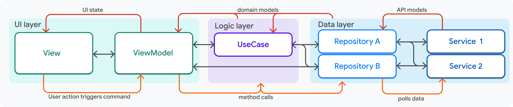
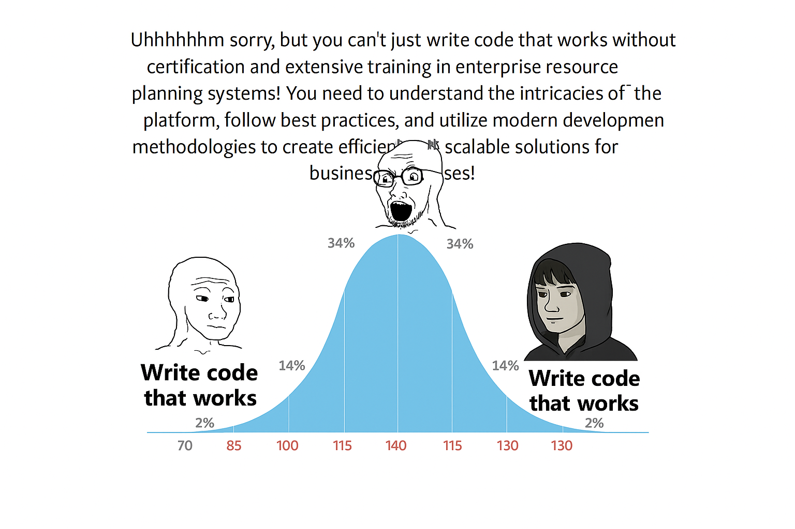

# InApp SDK & Application architecture

References:

- [https://docs.flutter.dev/app-architecture/guide](https://docs.flutter.dev/app-architecture/guide)
- https://developer.android.com/topic/architecture
- [https://developer.apple.com/tutorials/app-dev-training/dissecting-an-apps-architecture](https://developer.apple.com/tutorials/app-dev-training/dissecting-an-apps-architecture)

This document outlines the proposed architecture for implementing the Reclaim Verifier's InApp SDK and Application source code. The architecture follows the Model-View-ViewModel (MVVM) pattern—officially recommended by Flutter—for building scalable and maintainable applications.

By adopting MVVM architecture, we aim to achieve:

- Clear separation of concerns between UI, business logic, and data layers
- Better testability of components
- Improved code maintenance and scalability
- Consistent development patterns across the codebase

This architectural approach ensures both the SDK and application remain maintainable and extensible as the project grows.

The architecture consists of these key components:

## UI layer

Located in the components/ directory, UI components come in two types:

- Simple components with ValueNotifier controllers for state management when independent of other services
- Complex components using ViewModels when dependent on services and other views

## Logic Layer

Business logic is organised into UseCase classes that:

- Encapsulate specific business operations
- Retrieve data through repository classes

## Data Layer

The data flow is structured as:

- Repository classes that aggregate data from multiple services, including retry logic, caching, refreshing, and polling
- Services that handle:
    - Platform API calls
    - HTTP server communications
    - File system operations

This layered approach ensures clean separation of concerns and maintainable code structure.

# Implementation Approach

Having established the foundational architecture principles, let's explore how to implement this architecture in our SDK and application. The following sections will detail:

- Specific code organization and file structure
- Implementation patterns for each architectural layer
- Communication between SDK and application layers
- Best practices for maintaining clean separation between SDK and app code

Let's examine each of these aspects in detail.

## Code organization and file structure

1. Move all code inside the src/ directory. Code inside this directory is package internal and will only be exposed if files are explicitly exported from files in the lib/ directory. We suggest using barrel exports in src/ for different types of organization (e.g., utils/utils.dart, crypto/crypto.dart).
2. Use Flutter's recommended lint rules with additional restrictions as needed, enforced by CI/CD dart analyzer tests. Code formatting will be checked using Dart's standard formatter.
3. Files can be organized as:
    1. assets/: Provides access to app assets, network resources, and other sources
    2. data/: Common typedefs and data classes.
    3. exception/: These can be within other components.
    4. [bigger components by name]/
    5. widgets/: UI components that doesn’t interact with other views, or components and may have a controller that extends ValueNotifier if required control by parent.
    6. utils/
    7. services/
    8. theme/
    9. usecase/
    10. repository/

- For managing states, prefer setState for smaller components with ephemeral data like widgets or ValueNotifiers.
- Use controllers that extend ValueNotifier for components that are meant to be controlled by parents. States to which the UI reacts should be immutable and kept inside ValueNotifier.value.
- For larger components, prefer using StreamController’s sink, stream and transform. View updates and use of BuildContext should strictly be inside widgets.

We have 4 major systems in our code:

1. Claim Creation Screen: Uses a webview in the foreground. This claim creation webview injects provider scripts and request interception scripts to identify correct requests for claim creation.
2. Attestor: Handles interaction with the attestor for claim creation, proof computation, ZK operator usage, and extraction of HTML/XML with XPath and JSON field-values with JSONPath.
3. Claim Creation Updates: Displays parameters being processed in claims, submits automatically when complete, or prompts users to review parameters with a submit button.
4. I have no knowledge about AI flow. [NEED HELP]

## Communication between SDK and application layers

- This refactor should focus on ensuring exposed apis will be stable and the UIs offer better UX.
- Suggestions from [https://www.notion.so/questbook/Better-Error-handling-user-expectation-setting-1d5275b816cb80228372f529c8b81b67](https://www.notion.so/Better-Error-handling-user-expectation-setting-1d5275b816cb80228372f529c8b81b67?pvs=21) should also be noted.
- Dart files directly inside lib/ must be used to expose apis that can be used by consumers like the reclaim verifier app or the reclaim inapp add-to-app module. Tests should ensure that new changes don’t break the apis.

# App related changes

- App should use components and themes from the sdk
- Navigation stack should be different (or replaced) when app started from a deeplink (Please refer [https://pub.dev/documentation/go_router/latest/topics/Deep linking-topic.html](https://pub.dev/documentation/go_router/latest/topics/Deep%20linking-topic.html)). We should prefer declarative routing with one of the top navigation packages (i.e [go_router](https://pub.dev/packages/go_router)) as this method is recommended by the community. Consider removing dependency from app link package because navigation can receive deeplink now (before removal please check if this woks with instant app and app clips).
- Routes should be organized like this:
    - /demo or /start - flow related to demo where you can see the landing page and then search for a provider in a sub-menu or launch dev testing screen.
    - /verify or /verifier - that starts the verification flow with the reusue proofs prompt and sdk and then after sdk screen closes shows a success or failure screens.

## **State Management Strategy**

State in our architecture is categorized into three types:

1. **Ephemeral UI state**
    - Local to a single widget (e.g., toggles, focus state).
    - Use: setState() or local ValueNotifier.
2. **Component-controlled state**
    - Managed by parent and passed down to child widgets.
    - Use: ValueNotifier extended into custom controllers.
3. **Business/Shared state**
    - App-wide or feature-wide state that persists across multiple views or survives navigation.
    - Use: ViewModel classes powered by StreamController, StateNotifier, or Riverpod providers.

One rule that may help is that components should be independently usable or testable. This will help us in the organization. Prefer keeping components in their own sub-directories.

- UI and navigation code like the use of context should strictly be in widgets.
- Use view models for having/preparing the data that the UI needs.
- Repositories will take care of how to get data, whether to cache it, etc.
- Services will fetch the data from a source like OS-platform apis, plugins, db, http servers, etc

(Please correct if anything needs improvement)

## So how do we start?

My personal opinion: 

- We modify each components as we touch them with every new task/issue and refactor other components when we get time and new things should also follow newer architecture. Changing whole codebase while we pause other work may not be the best approach.

